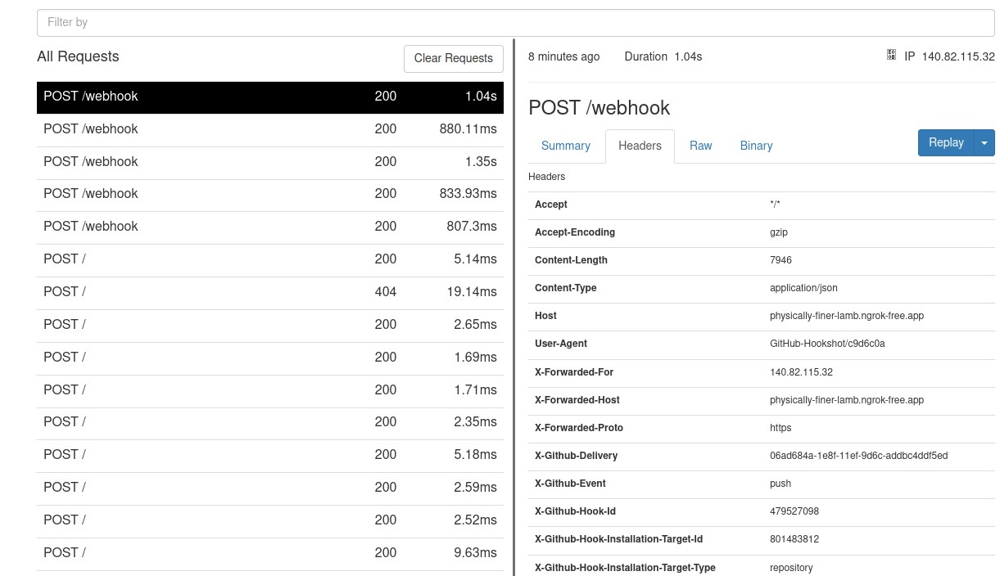

# Durchlauf

## Vorbereitung
1. Docker Compose initialisieren
2. Ngrok starten
3. Producer Applikation starten
4. Auf Domain Controller die Consumer-Applikation als Administrator ausführen. (Zur überwachung aus einem Admin Powershell-Terminal starten.)
5. AdUser commit vorbereiten.

## Durchführung

Es wird ein Commit auf dem eingerichteten Repository gepusht.

Ngrok leitet den Webhook an den Producer weiter, welcher auf dem Port **8080** definiert ist.

Die Producer-Applikation verarbeitet die Informationen des Webhooks, anhand dieser Informationen holt sie sich die Json-Datei vor dem Commit und nach dem Commit, um die beiden miteinander zu vergleichen, um aus den neuen Benutzern für Kafka ein neues Event für jeden neuen Benutzer zu generieren.

Die Consumer-Applikation registriert das neue Ereignis auf dem Kafka-Stream, ruft das Ereignis ab und verwendet diese Informationen, um einen Powershell-Befehl auszuführen, der den neuen Benutzer erstellt.

Kontrolle zeigt den neu generierten AD-User auf dem Domain-Controller

