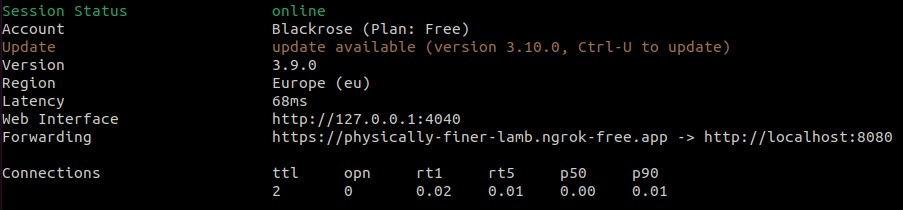
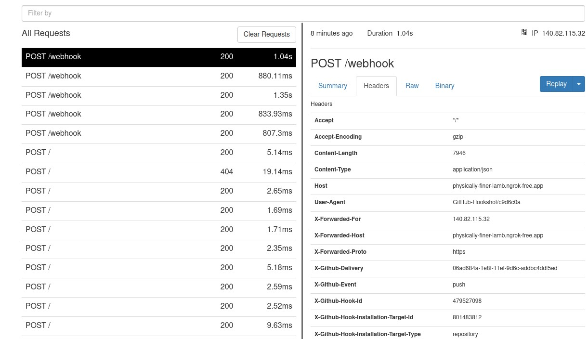

# Ngrok

Ngrok wird verwendet, um der Entwicklungsumgebung eine öffentliche URL zur Verfügung zu stellen, sodass diese lokal mit einer meiner Schnittstellen verbunden werden kann. Dies ist wichtig, damit beim Webhook von GitHub auch eine URL-Adresse angegeben werden kann, an die die jeweiligen Payloads gesendet werden sollen.

## Installation & Konfiguration

Zu Beginn wird ein Free-Account bei Ngrok benötigt, den man unter https://ngrok.com/ erstellen kann. Die Anleitung zur Installation und Konfiguration findet man direkt unter dem [Link Getting Started](https://dashboard.ngrok.com/get-started/setup/linux).

**Installation**
````bash
curl -s https://ngrok-agent.s3.amazonaws.com/ngrok.asc \
| sudo tee /etc/apt/trusted.gpg.d/ngrok.asc >/dev/null \
&& echo "deb https://ngrok-agent.s3.amazonaws.com buster main" \
| sudo tee /etc/apt/sources.list.d/ngrok.list \
&& sudo apt update \
&& sudo apt install ngrok
````

**Konfiguration Authtoken**

````bash
ngrok config add-authtoken PERSÖHNLICHER_AUTHTOKEN
````

**Konfiguration kontrollieren**

Es ist zwar im Moment nur der Authtoken definiert, jedoch kann man sicherlich noch mehr konfigurieren. Allerdings gibt es Einschränkungen durch die Free-Version.

````bash
ngrok config edit
````

**Initialisierung**

Bei der Initialisierung kann über --domain eine eingerichtete Domain von Ngrok angegeben werden, damit auch bei Neustarts dieselbe Domain nach außen dargestellt wird. Dies ist wichtig, damit beim Webhook nicht immer die URL angepasst werden muss. Anschließend gibt man noch den Port des Dienstes an, der unter dieser URL erreichbar sein soll.

````bash
ngrok http --domain=physically-finer-lamb.ngrok-free.app 8080
````



## Webübersicht Ngrok Service

Unter http://localhost:4040 erhält man eine Übersicht über den Ngrok-Dienst. Hier kann man einsehen, welche Anfragen bei der URL eingegangen sind und welchen Inhalt diese Anfragen hatten.

