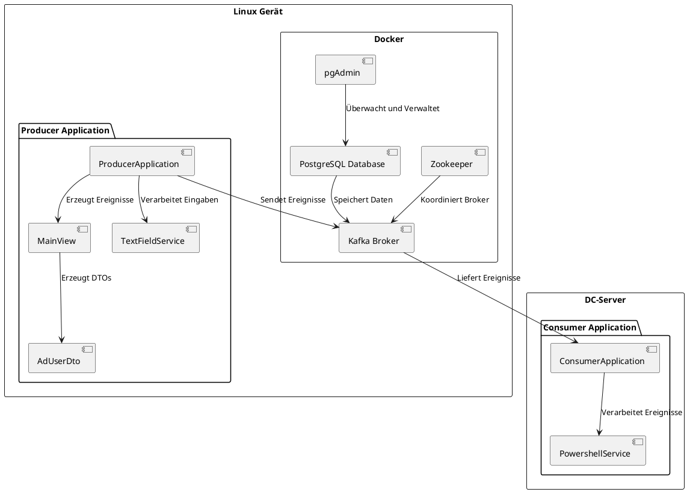

# Struktur

```plantuml
@startuml

RECTANGLE "Linux Gerät" {
    package "Producer Application" {
        [ProducerApplication] as ProducerApp
        [MainView] as MainView
        [TextFieldService] as TextFieldService
        [AdUserDto] as AdUserDto
    }
    RECTANGLE "Docker" {
        [PostgreSQL Database] as Database
        [Zookeeper] as Zookeeper
        [Kafka Broker] as KafkaBroker
        [pgAdmin] as PgAdmin
    }
}

RECTANGLE "DC-Server" {
    package "Consumer Application" {
        [ConsumerApplication] as ConsumerApp
        [PowershellService] as PowershellService
    }
}

ProducerApp --> MainView : Erzeugt Ereignisse
ProducerApp --> TextFieldService : Verarbeitet Eingaben
MainView --> AdUserDto : Erzeugt DTOs
ConsumerApp --> PowershellService : Verarbeitet Ereignisse

Database --> KafkaBroker : Speichert Daten
Zookeeper --> KafkaBroker : Koordiniert Broker
PgAdmin --> Database : Überwacht und Verwaltet
ProducerApp --> KafkaBroker : Sendet Ereignisse
KafkaBroker --> ConsumerApp : Liefert Ereignisse

@enduml
```
