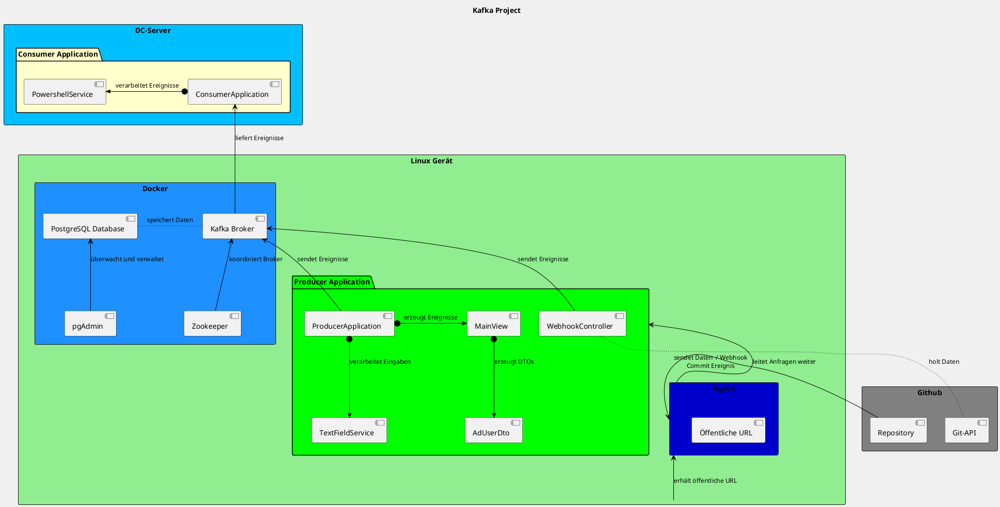

# Struktur

```plantuml
@startuml
!include <archimate/Archimate>
skinparam backgroundColor #F0F0F0
skinparam shadowing false


Title Kafka Project

RECTANGLE "Github" as GitHubColor #grey {
    [Repository] as Repo
    [Git-API] as GitApi
}


RECTANGLE "Linux Gerät" as LinuxColor #LightGreen {
    package "Producer Application" as ProducerAppColor #Lime {
        [ProducerApplication] as ProducerApp
        [MainView] as MainView
        [TextFieldService] as TextFieldService
        [AdUserDto] as AdUserDto
        [WebhookController] as Controller
    }
    RECTANGLE "Docker" as DockerColor #DodgerBlue {
        [PostgreSQL Database] as Database
        [Zookeeper] as Zookeeper
        [Kafka Broker] as KafkaBroker
        [pgAdmin] as PgAdmin
    }
    RECTANGLE "Ngrok" as NgrokColor #MediumBlue {
        [Öffentliche URL] as NgrokService
    }
}
RECTANGLE "DC-Server" as DCServerColor #DeepSkyBlue {
    package "Consumer Application" as ConsumerAppColor #BUSINESS {
        [ConsumerApplication] as ConsumerApp
        [PowershellService] as PowershellService
    }
}

' Relationships
Rel_Serving_Left(Repo, NgrokColor, "sendet Daten  / Webhook Commit Ereignis")
Rel_Access_Down(Controller, GitApi, "holt Daten")
Rel_Serving_Down(Controller, KafkaBroker, "sendet Ereignisse")
Rel_Assignment_Left(ProducerApp, MainView, "erzeugt Ereignisse")
Rel_Assignment_Down(ProducerApp, TextFieldService, "verarbeitet Eingaben")
Rel_Assignment_Down(MainView, AdUserDto, "erzeugt DTOs")
Rel_Assignment_Left(ConsumerApp, PowershellService, "verarbeitet Ereignisse")
Rel_Access_Left(Database, KafkaBroker, "speichert Daten")
Rel_Serving_Up(Zookeeper, KafkaBroker, "koordiniert Broker")
Rel_Serving_Up(PgAdmin, Database, "überwacht und verwaltet")
Rel_Serving_Up(ProducerApp, KafkaBroker, "sendet Ereignisse")
Rel_Serving_Up(KafkaBroker, ConsumerApp, "liefert Ereignisse")

' Neue Beziehungen zu Ngrok hinzugefügt
Rel_Serving_Up(LinuxColor, NgrokColor, "erhält öffentliche URL")
Rel_Serving_Up(NgrokColor, ProducerAppColor, "leitet Anfragen weiter")
@enduml
```