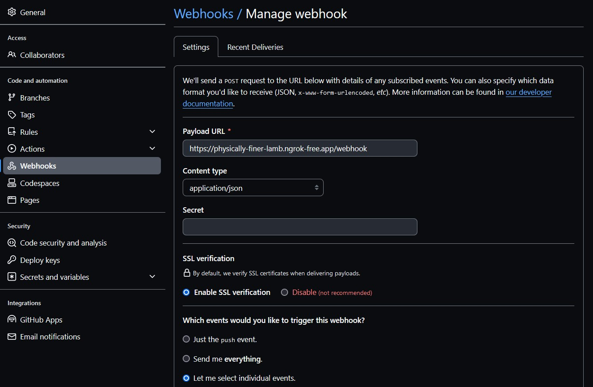

# GitHub

Um den Webhook-Controller in der Spring Boot-Anwendung mit GitHub zu integrieren und die erforderlichen Konfigurationen vorzunehmen, benötigen wir ein GitHub-Repository, einen Webhook, der auf ein bestimmtes Ereignis reagiert, und die korrekten API-Zugriffsdaten.

## GitHub-Repository einrichten

Erstellen Sie ein GitHub-Repository und fügen Sie eine JSON-Datei mit der folgenden Struktur hinzu:

````json
[
  {
    "surname": "Beispiel",
    "name": "Beispiel",
    "phoneNumber": "+1 11 111 11 11",
    "department": "IT"
  },
  {
    "surname": "Beispiel2",
    "name": "Beispiel2",
    "phoneNumber": "+2 22 222 22 22",
    "department": "HR"
  }
]
````
Die Datei könnte z.B. users.json heissen und im Root-Verzeichnis des Repositories liegen. 

## Webhook auf GitHub einrichten

- **Navigieren zu Settings > Webhooks > Add webhook.**
- **Setzen vom Payload URL auf die öffentliche URL, die von Ngrok bereitgestellt wird (z.B., http://<ngrok-id>.ngrok.io/webhook).**
- **Content type auf application/json. setzen**
- **Wähle ``Let me select individual events`` und wählen Sie ``Push-Ereignisse`` aus.**

    

- **Klicken auf Add webhook.**

## Payload

Sobald ein Commit gepusht wird, wird ein Payload an die Angegebene URL-Adresse versendet der wie folgt aussieht.

**Headers**
````
Request URL: https://physically-finer-lamb.ngrok-free.app/webhook
Request method: POST
Accept: */*
Content-Type: application/json
User-Agent: GitHub-Hookshot/c9d6c0a
X-GitHub-Delivery: 06ad684a-1e8f-11ef-9d6c-addbc4ddf5ed
X-GitHub-Event: push
X-GitHub-Hook-ID: 479527098
X-GitHub-Hook-Installation-Target-ID: 801483812
X-GitHub-Hook-Installation-Target-Type: repository
````

**Payload**
````json
{
    "ref": "refs/heads/main",
    "before": "23e53cf62f1c42a382c930785029a8e6b825baab",
    "after": "31e598288a5dfe3b409c6c54aae982329a3ab08d",
    "repository": {
        "id": 801483812,
        "node_id": "R_kgDOL8WsJA",
        "name": "GitVerzeichnis",
        "full_name": "Blackrose-1337/GitVerzeichnis",
        "private": true,
        "owner": {
            "name": "Blackrose-1337",
            "email": "83408677+Blackrose-1337@users.noreply.github.com",
            "login": "Blackrose-1337",
            "id": 83408677,
            "node_id": "MDQ6VXNlcjgzNDA4Njc3",
            "avatar_url": "https://avatars.githubusercontent.com/u/83408677?v=4",
            "gravatar_id": "",
            "url": "https://api.github.com/users/Blackrose-1337",
            "html_url": "https://github.com/Blackrose-1337",
            "followers_url": "https://api.github.com/users/Blackrose-1337/followers",
            "following_url": "https://api.github.com/users/Blackrose-1337/following{/other_user}",
            "gists_url": "https://api.github.com/users/Blackrose-1337/gists{/gist_id}",
            "starred_url": "https://api.github.com/users/Blackrose-1337/starred{/owner}{/repo}",
            "subscriptions_url": "https://api.github.com/users/Blackrose-1337/subscriptions",
            "organizations_url": "https://api.github.com/users/Blackrose-1337/orgs",
            "repos_url": "https://api.github.com/users/Blackrose-1337/repos",
            "events_url": "https://api.github.com/users/Blackrose-1337/events{/privacy}",
            "received_events_url": "https://api.github.com/users/Blackrose-1337/received_events",
            "type": "User",
            "site_admin": false
        },
        "html_url": "https://github.com/Blackrose-1337/GitVerzeichnis",
        "description": null,
        "fork": false,
        "url": "https://github.com/Blackrose-1337/GitVerzeichnis",
        "forks_url": "https://api.github.com/repos/Blackrose-1337/GitVerzeichnis/forks",
        "keys_url": "https://api.github.com/repos/Blackrose-1337/GitVerzeichnis/keys{/key_id}",
        "collaborators_url": "https://api.github.com/repos/Blackrose-1337/GitVerzeichnis/collaborators{/collaborator}",
        "teams_url": "https://api.github.com/repos/Blackrose-1337/GitVerzeichnis/teams",
        "hooks_url": "https://api.github.com/repos/Blackrose-1337/GitVerzeichnis/hooks",
        "issue_events_url": "https://api.github.com/repos/Blackrose-1337/GitVerzeichnis/issues/events{/number}",
        "events_url": "https://api.github.com/repos/Blackrose-1337/GitVerzeichnis/events",
        "assignees_url": "https://api.github.com/repos/Blackrose-1337/GitVerzeichnis/assignees{/user}",
        "branches_url": "https://api.github.com/repos/Blackrose-1337/GitVerzeichnis/branches{/branch}",
        "tags_url": "https://api.github.com/repos/Blackrose-1337/GitVerzeichnis/tags",
        "blobs_url": "https://api.github.com/repos/Blackrose-1337/GitVerzeichnis/git/blobs{/sha}",
        "git_tags_url": "https://api.github.com/repos/Blackrose-1337/GitVerzeichnis/git/tags{/sha}",
        "git_refs_url": "https://api.github.com/repos/Blackrose-1337/GitVerzeichnis/git/refs{/sha}",
        "trees_url": "https://api.github.com/repos/Blackrose-1337/GitVerzeichnis/git/trees{/sha}",
        "statuses_url": "https://api.github.com/repos/Blackrose-1337/GitVerzeichnis/statuses/{sha}",
        "languages_url": "https://api.github.com/repos/Blackrose-1337/GitVerzeichnis/languages",
        "stargazers_url": "https://api.github.com/repos/Blackrose-1337/GitVerzeichnis/stargazers",
        "contributors_url": "https://api.github.com/repos/Blackrose-1337/GitVerzeichnis/contributors",
        "subscribers_url": "https://api.github.com/repos/Blackrose-1337/GitVerzeichnis/subscribers",
        "subscription_url": "https://api.github.com/repos/Blackrose-1337/GitVerzeichnis/subscription",
        "commits_url": "https://api.github.com/repos/Blackrose-1337/GitVerzeichnis/commits{/sha}",
        "git_commits_url": "https://api.github.com/repos/Blackrose-1337/GitVerzeichnis/git/commits{/sha}",
        "comments_url": "https://api.github.com/repos/Blackrose-1337/GitVerzeichnis/comments{/number}",
        "issue_comment_url": "https://api.github.com/repos/Blackrose-1337/GitVerzeichnis/issues/comments{/number}",
        "contents_url": "https://api.github.com/repos/Blackrose-1337/GitVerzeichnis/contents/{+path}",
        "compare_url": "https://api.github.com/repos/Blackrose-1337/GitVerzeichnis/compare/{base}...{head}",
        "merges_url": "https://api.github.com/repos/Blackrose-1337/GitVerzeichnis/merges",
        "archive_url": "https://api.github.com/repos/Blackrose-1337/GitVerzeichnis/{archive_format}{/ref}",
        "downloads_url": "https://api.github.com/repos/Blackrose-1337/GitVerzeichnis/downloads",
        "issues_url": "https://api.github.com/repos/Blackrose-1337/GitVerzeichnis/issues{/number}",
        "pulls_url": "https://api.github.com/repos/Blackrose-1337/GitVerzeichnis/pulls{/number}",
        "milestones_url": "https://api.github.com/repos/Blackrose-1337/GitVerzeichnis/milestones{/number}",
        "notifications_url": "https://api.github.com/repos/Blackrose-1337/GitVerzeichnis/notifications{?since,all,participating}",
        "labels_url": "https://api.github.com/repos/Blackrose-1337/GitVerzeichnis/labels{/name}",
        "releases_url": "https://api.github.com/repos/Blackrose-1337/GitVerzeichnis/releases{/id}",
        "deployments_url": "https://api.github.com/repos/Blackrose-1337/GitVerzeichnis/deployments",
        "created_at": 1715854489,
        "updated_at": "2024-05-30T14:14:19Z",
        "pushed_at": 1717078510,
        "git_url": "git://github.com/Blackrose-1337/GitVerzeichnis.git",
        "ssh_url": "git@github.com:Blackrose-1337/GitVerzeichnis.git",
        "clone_url": "https://github.com/Blackrose-1337/GitVerzeichnis.git",
        "svn_url": "https://github.com/Blackrose-1337/GitVerzeichnis",
        "homepage": null,
        "size": 14,
        "stargazers_count": 0,
        "watchers_count": 0,
        "language": null,
        "has_issues": true,
        "has_projects": true,
        "has_downloads": true,
        "has_wiki": false,
        "has_pages": false,
        "has_discussions": false,
        "forks_count": 0,
        "mirror_url": null,
        "archived": false,
        "disabled": false,
        "open_issues_count": 0,
        "license": null,
        "allow_forking": true,
        "is_template": false,
        "web_commit_signoff_required": false,
        "topics": [
            ],
        "visibility": "private",
        "forks": 0,
        "open_issues": 0,
        "watchers": 0,
        "default_branch": "main",
        "stargazers": 0,
        "master_branch": "main"
    },
    "pusher": {
        "name": "Blackrose-1337",
        "email": "83408677+Blackrose-1337@users.noreply.github.com"
    },
    "sender": {
        "login": "Blackrose-1337",
        "id": 83408677,
        "node_id": "MDQ6VXNlcjgzNDA4Njc3",
        "avatar_url": "https://avatars.githubusercontent.com/u/83408677?v=4",
        "gravatar_id": "",
        "url": "https://api.github.com/users/Blackrose-1337",
        "html_url": "https://github.com/Blackrose-1337",
        "followers_url": "https://api.github.com/users/Blackrose-1337/followers",
        "following_url": "https://api.github.com/users/Blackrose-1337/following{/other_user}",
        "gists_url": "https://api.github.com/users/Blackrose-1337/gists{/gist_id}",
        "starred_url": "https://api.github.com/users/Blackrose-1337/starred{/owner}{/repo}",
        "subscriptions_url": "https://api.github.com/users/Blackrose-1337/subscriptions",
        "organizations_url": "https://api.github.com/users/Blackrose-1337/orgs",
        "repos_url": "https://api.github.com/users/Blackrose-1337/repos",
        "events_url": "https://api.github.com/users/Blackrose-1337/events{/privacy}",
        "received_events_url": "https://api.github.com/users/Blackrose-1337/received_events",
        "type": "User",
        "site_admin": false
    },
    "created": false,
    "deleted": false,
    "forced": false,
    "base_ref": null,
    "compare": "https://github.com/Blackrose-1337/GitVerzeichnis/compare/23e53cf62f1c...31e598288a5d",
    "commits": [
        {
            "id": "31e598288a5dfe3b409c6c54aae982329a3ab08d",
            "tree_id": "853c35c141f385b3fc5147eee4473a338411ee13",
            "distinct": true,
            "message": "add: AdUser",
            "timestamp": "2024-05-30T16:15:04+02:00",
            "url": "https://github.com/Blackrose-1337/GitVerzeichnis/commit/31e598288a5dfe3b409c6c54aae982329a3ab08d",
            "author": {
                "name": "Blackrose-1337",
                "email": "21s6627@bztf.ch",
                "username": "Blackrose-1337"
            },
            "committer": {
                "name": "Blackrose-1337",
                "email": "21s6627@bztf.ch",
                "username": "Blackrose-1337"
            },
            "added": [
                  ],
            "removed": [
            ], 
            "modified": [
                "ordner/test"
            ]
        }
    ],
    "head_commit": {
        "id": "31e598288a5dfe3b409c6c54aae982329a3ab08d",
        "tree_id": "853c35c141f385b3fc5147eee4473a338411ee13",
        "distinct": true,
        "message": "add: AdUser",
        "timestamp": "2024-05-30T16:15:04+02:00",
        "url": "https://github.com/Blackrose-1337/GitVerzeichnis/commit/31e598288a5dfe3b409c6c54aae982329a3ab08d",
        "author": {
            "name": "Blackrose-1337",
            "email": "21s6627@bztf.ch",
            "username": "Blackrose-1337"
        },
        "committer": {
            "name": "Blackrose-1337",
            "email": "21s6627@bztf.ch",
            "username": "Blackrose-1337"
        },
        "added": [
        ], 
        "removed": [
        ],
        "modified": [
            "ordner/test"
        ]
    }
}
````

Die Informationen, die für die API-Abfragen benötigt werden, sind nur ``after``, ``before`` & die **``Pfade``**, wo sich die hinzugefügten oder geänderten Dateien befinden.

```json
[
  {
    "after": "31e598288a5dfe3b409c6c54aae982329a3ab08d",
    "before": "23e53cf62f1c42a382c930785029a8e6b825baab",
    "commits": {
      "added": [
      ],
      "removed": [
      ], 
      "modified": [
          "ordner/test"
      ]
    }
  }
]
````